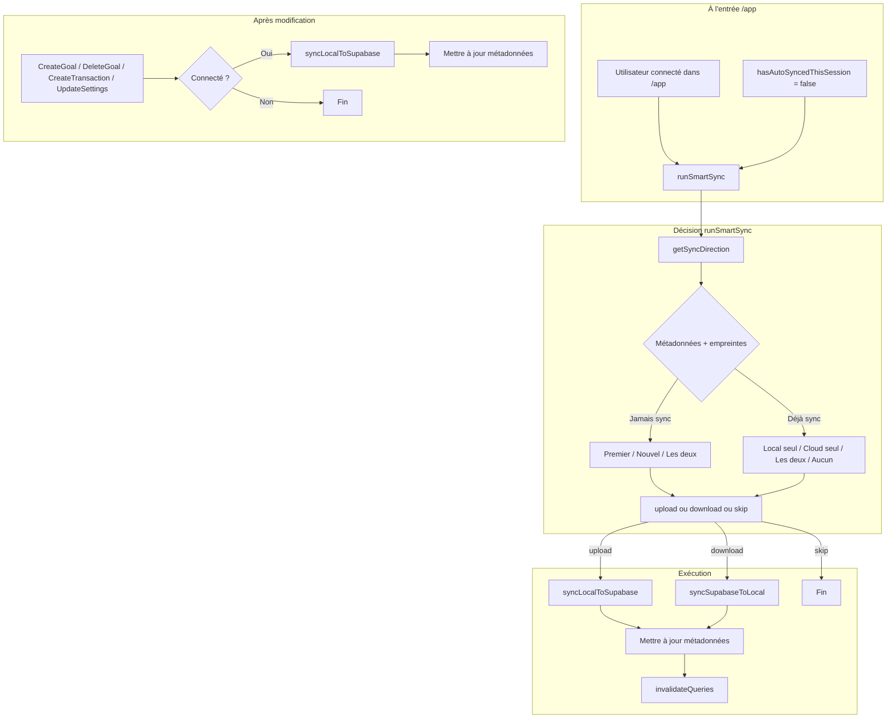

# Auto-sync automatique et choix de direction intelligent

## Objectif

- Lancer une sync **automatiquement** lorsque l’utilisateur est connecté et se trouve dans la zone `/app`.
- Décider de façon **déterministe** : exécuter d’abord **upload** (local → Supabase), ou d’abord **download** (Supabase → local), ou **ne pas synchroniser**.

## 1. Métadonnées de sync (localStorage)

Pour savoir “qui a changé depuis la dernière sync”, il faut persister un peu d’état.

**Fichier** : [client/src/lib/localStorage.ts](client/src/lib/localStorage.ts) (ou un petit module dédié `syncMetadata.ts`).

- **Nouvelles clés** (ex. dans `STORAGE_KEYS` ou équivalent) :
  - `lastSyncAt` : date ISO de la dernière sync réussie (toute direction).
  - `lastSyncLocalGoalsCount` : nombre de goals en local au moment de cette sync.
  - `lastSyncCloudGoalsCount` : nombre de goals côté cloud pour le groupe au moment de cette sync.
- **Fonctions** : `getSyncMetadata()`, `setSyncMetadata({ lastSyncAt, lastSyncLocalGoalsCount, lastSyncCloudGoalsCount })`, appelées après chaque sync réussie (manuelle ou auto) et utilisées par la logique de décision.

Les deux sens (upload et download) doivent mettre à jour ces métadonnées après succès (en plus du code existant dans [client/src/lib/supabase.ts](client/src/lib/supabase.ts)).

## 2. “Empreinte” cloud et locale

Pour la décision, il faut comparer **nombre de goals** et **fraîcheur** (dernière activité).

**Fichier** : [client/src/lib/supabase.ts](client/src/lib/supabase.ts).

- **Cloud** : ajouter une fonction (ex. `getCloudSyncFingerprint(groupId)` ou réutiliser une requête existante) qui, pour le groupe courant, retourne :
  - `goalsCount` : nombre de goals du groupe.
  - `latestCreatedAt` : `max(createdAt)` des goals du groupe (ou `createdAt` du dernier goal si plus simple).  
  Implémentation possible : une requête `goals` avec `.select('createdAt').eq('group_id', groupId).order('createdAt', { ascending: false }).limit(1)` pour la date, et une requête count ou `length` du tableau des goals du groupe.
- **Local** : fonction (ex. dans `localStorage` ou `supabase.ts`) qui retourne :
  - `goalsCount` : `localStorageService.getGoals().length`.
  - `latestCreatedAt` : `max(createdAt)` des goals locaux (ou `undefined` si aucun).

Pas de hash nécessaire : comparaison sur **count + latestCreatedAt** suffit pour une heuristique “très intelligente” sans schéma Supabase supplémentaire.

## 3. Logique de décision : upload first vs download first vs skip

**Fichier** : [client/src/lib/supabase.ts](client/src/lib/supabase.ts) (ou `client/src/lib/syncStrategy.ts`).

Une fonction unique, ex. `getSyncDirection(options): Promise<'upload' | 'download' | 'skip'>`, qui :

1. Vérifie qu’on a une session et un groupe (ex. `ensureUserHasGroup`), et que le client Supabase est dispo.
2. Récupère les métadonnées de dernière sync (`lastSyncAt`, `lastSyncLocalGoalsCount`, `lastSyncCloudGoalsCount`).
3. Récupère l’empreinte **actuelle** du cloud (count + latestCreatedAt) et du local (count + latestCreatedAt).
4. Applique les règles suivantes (à implémenter dans l’ordre) :

**Cas “jamais synchronisé”** (`!lastSyncAt`) :**

- Cloud vide (0 goals), local non vide → **upload** (premier appareil, on pousse).
- Cloud non vide, local vide → **download** (nouvel appareil / réinstall, on tire).
- Les deux non vides : **“le plus récent gagne”** : comparer `latestCreatedAt` local vs cloud ; si local plus récent → **upload**, sinon → **download**. En cas d’égalité, choix par défaut cohérent (ex. **download** pour privilégier le cloud).

**Cas “déjà synchronisé”** (`lastSyncAt` défini) :**

- **Seul le local a changé** : `localGoalsCount !== lastSyncLocalGoalsCount` (et optionnellement pas de changement côté cloud) → **upload**.
- **Seul le cloud a changé** : `cloudGoalsCount !== lastSyncCloudGoalsCount` (et pas de changement local) → **download**.
- **Les deux ont changé** : comparer à nouveau `latestCreatedAt` ; le plus récent gagne (upload vs download). Si aucune info de date fiable, défaut ex. **download**.
- **Aucun changement** (mêmes counts qu’au lastSync) → **skip**.

La fonction ne fait **que** décider la direction ; elle n’exécute pas la sync. Elle sera utilisée par l’auto-sync et, si tu le souhaites plus tard, par les boutons manuels pour pré-remplir le sens par défaut.

## 4. Exécution de la sync selon la direction

**Fichier** : [client/src/lib/supabase.ts](client/src/lib/supabase.ts).

- Exposer une fonction ex. `**runSmartSync(client?)`** qui :
  1. Appelle `getSyncDirection(...)`.
  2. Si `'skip'` : return sans rien faire.
  3. Si `'upload'` : appelle `syncLocalToSupabase(client)` puis met à jour les métadonnées (local count, cloud count après upload, lastSyncAt).
  4. Si `'download'` : appelle `syncSupabaseToLocal(client)` puis met à jour les métadonnées (même chose après download).
  5. En cas d’erreur, ne pas mettre à jour les métadonnées (pour que la prochaine tentative reparte du même état).

Les fonctions existantes `syncLocalToSupabase` et `syncSupabaseToLocal` restent inchangées dans leur sémantique ; on les appelle depuis `runSmartSync` et on persiste les métadonnées après succès (soit dans ces fonctions, soit dans `runSmartSync` après chaque appel réussi).

## 5. Déclenchement automatique quand connecté (entrée dans /app)

- **Où** : une seule fois par “session connectée” lorsqu’on est dans la zone `/app` (Dashboard, Settings, ou détail d’un goal). Pour éviter de lancer la sync à chaque navigation, utiliser un **hook** (ex. `useAutoSync`) avec un ref du type `hasAutoSyncedThisSession`, réinitialisé quand `isSignedIn` passe à false.
- **Où le placer** : soit un composant wrapper qui enveloppe toutes les routes sous `/app` (et qui rend les enfants + appelle `useAutoSync`), soit le hook utilisé dans le premier écran “entrée” dans /app (ex. Dashboard). Éviter de l’appeler à la fois sur Dashboard et Settings pour ne pas déclencher deux sync d’affilée.
- **Comportement** : si `isSignedIn && getSupabase()` dispo et que `!hasAutoSyncedThisSession`, appeler `runSmartSync()`, puis invalidation des queries React Query (goals, settings), puis mettre `hasAutoSyncedThisSession = true`. Optionnel : toast discret “Synchronisation effectuée” ou rien pour rester silencieux.
- **Fichiers** : [client/src/App.tsx](client/src/App.tsx) (ou un layout dédié pour `/app`) pour le wrapper qui appelle le hook ; le hook peut vivre dans `client/src/hooks/use-auto-sync.ts`.

## 5bis. Sync après chaque modification (création / modification / suppression)

Dès qu'une **action locale** modifie les données, si l'utilisateur est **connecté**, lancer un **upload** (local → Supabase) en arrière-plan pour garder le cloud à jour.

- **Mutations concernées** :
  - **Création d'objectif** : [client/src/hooks/use-goals.ts](client/src/hooks/use-goals.ts) — `useCreateGoal()`, dans le `onSuccess` de la mutation.
  - **Suppression d'objectif** : même fichier — `useDeleteGoal()`, dans le `onSuccess`.
  - **Création de transaction** : [client/src/hooks/use-transactions.ts](client/src/hooks/use-transactions.ts) — `useCreateTransaction()`, dans le `onSuccess`.
  - **Mise à jour des paramètres** : [client/src/hooks/use-settings.ts](client/src/hooks/use-settings.ts) — mutation d'update des settings, dans le `onSuccess`.
- **Comportement** : dans chaque `onSuccess`, si `getSupabase()` est dispo et qu'une session existe (ex. `(await getSupabase().auth.getUser()).data.user`), appeler `**syncLocalToSupabase()`** en arrière-plan (fire-and-forget, sans bloquer l'UI). Mettre à jour les métadonnées de sync après succès de l'upload (même logique que dans `runSmartSync`). En cas d'erreur, ne pas bloquer ni afficher d'erreur intrusive (optionnel : toast discret "Sync reportée" ou rien).
- **Contrainte** : les hooks de mutation n'ont pas accès à `useSession()` sans être utilisés dans un composant. Solution : dans le hook, appeler `getSupabase()` puis `getSupabase().auth.getUser()` ; si `user` présent, lancer `syncLocalToSupabase()` (sans await pour ne pas retarder le feedback utilisateur).

## 6. Mise à jour des métadonnées après sync manuelle

- Dans [client/src/pages/Settings.tsx](client/src/pages/Settings.tsx), après succès de **handleSync** (upload) et de **handleDownload** (download), appeler la même logique de mise à jour des métadonnées que dans `runSmartSync` (mêmes champs `lastSyncAt`, `lastSyncLocalGoalsCount`, `lastSyncCloudGoalsCount`), pour que la prochaine auto-sync parte du bon état.

## 7. Schéma récapitulatif

**Deux types de déclenchement :**

1. **À l’entrée dans /app (connecté)** : une fois par session → `runSmartSync()` (décision upload / download / skip).
2. **Après chaque mutation** (création/suppression goal, création transaction, update settings) : si connecté → **upload** (`syncLocalToSupabase`) en arrière-plan.

## Ordre d’implémentation recommandé

1. Métadonnées de sync (clés + get/set) dans localStorage (ou module dédié).
2. Empreintes : `getCloudSyncFingerprint`, plus fonction locale (count + latestCreatedAt).
3. `getSyncDirection()` puis `runSmartSync()` dans supabase (ou module sync), avec mise à jour des métadonnées après chaque sync réussie.
4. Mise à jour des métadonnées après les sync manuelles (Settings).
5. Hook `useAutoSync` + wrapper (ou intégration dans une route /app) pour déclencher une fois par session connectée.
6. **Sync après mutation** : dans `useCreateGoal`, `useDeleteGoal`, `useCreateTransaction` et la mutation d'update des settings, dans chaque `onSuccess`, si connecté, appeler `syncLocalToSupabase()` en arrière-plan et mettre à jour les métadonnées après succès.

Aucun changement de schéma Supabase n’est nécessaire ; la “fraîcheur” repose sur les counts et `createdAt` des goals déjà présents.